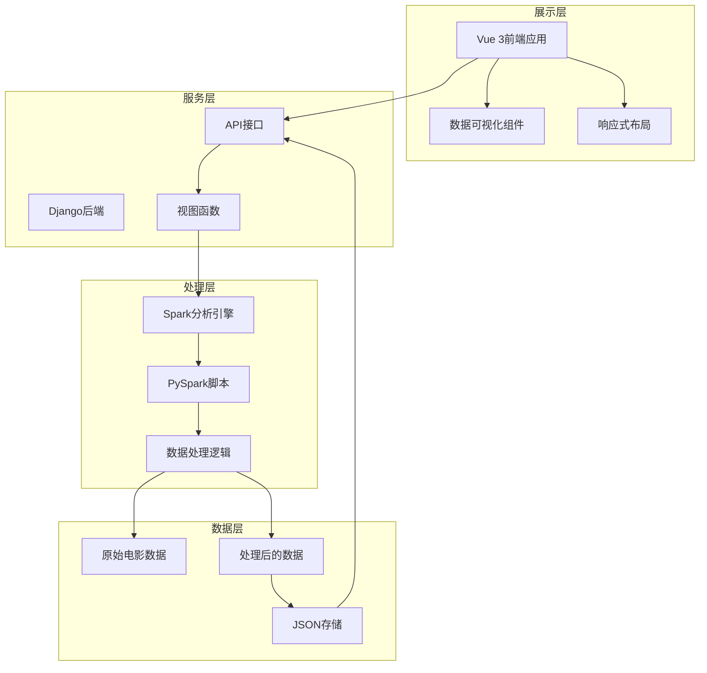
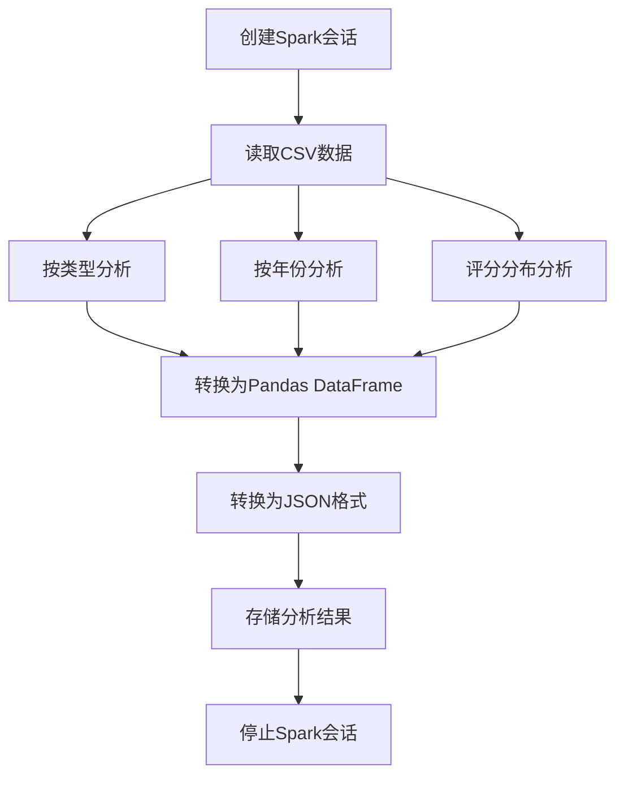

<div align="center">

# 电影分析全栈 | Movie-Analytics-Spark-Django-Vue

### End-to-end movie data analytics — Spark + Django + Vue3.

Distributed processing with Spark, a Django backend and a Vue3 frontend for professional movie-data visualization.

[](LICENSE)
[](https://www.python.org/)
[](https://spark.apache.org/)
[](https://www.djangoproject.com/)
[](https://vuejs.org/)

</div>

---

**Movie-Analytics-Spark-Django-Vue** is an end-to-end movie-data analytics platform: **Spark** for distributed processing, a **Django** backend serving APIs, and a **Vue3** frontend for interactive visualization.

> [!NOTE]
> 中文项目：电影数据分析可视化平台——Spark 分布式处理 + Django 后端 + Vue3 前端。

---

## Features

- **Spark processing** — distributed analytics over movie datasets.
- **Django API** — structured backend endpoints.
- **Vue3 frontend** — interactive, professional visualization.
- **Full-stack** — data → processing → API → visualization.

---

## Quickstart

```bash
git clone https://github.com/Windyhhh/Movie-Analytics-Spark-Django-Vue.git
cd Movie-Analytics-Spark-Django-Vue

# process data with Spark
spark-submit movie_analytics/process.py

# run Django backend
python manage.py runserver

# start Vue frontend
cd movie_analytics/frontend && npm install && npm run serve
```

---

## Project Structure

```
Movie-Analytics-Spark-Django-Vue/
├── movie_analytics/            # Django app
│   └── frontend/               # Vue3 SPA
├── datav/                      # data & processing
└── docs/                       # blog
```

---


## 项目深度解析

> 以下内容提炼自项目博客 [电影数据分析可视化平台博客.md](%E7%94%B5%E5%BD%B1%E6%95%B0%E6%8D%AE%E5%88%86%E6%9E%90%E5%8F%AF%E8%A7%86%E5%8C%96%E5%B9%B3%E5%8F%B0%E5%8D%9A%E5%AE%A2.md)，完整原文请点击链接。

# 电影数据分析可视化平台：基于Spark+Django+Vue3的全栈大数据应用实现（毕设/企业双适配）

> 作者：中科院计算机研究生 笙囧同学

## 项目基础信息：从需求到价值的全链路分析

### 项目背景

在大数据时代，电影产业产生了海量的数据，包括电影基本信息、用户评分、票房数据等。这些数据蕴含着巨大的商业价值和研究意义，但如何高效处理和分析这些数据，从中提取有价值的信息，并以直观的方式展示出来，成为了一个重要的技术挑战。

本项目旨在构建一个基于大数据技术栈的电影数据分析可视化平台，通过Spark进行分布式数据处理，Django提供后端API服务，Vue 3实现前端可视化展示，为用户提供多维度的电影数据分析结果。

**场景延伸**：该技术方案不仅适用于电影数据分析，还可以扩展到其他领域的数据分析场景，如电商商品分析、社交媒体用户行为分析、金融市场趋势分析等。

### 核心痛点

1. **数据处理效率低**：传统的单机数据处理方式无法应对大规模电影数据，处理速度慢，资源消耗大
   - **痛点成因**：电影数据量持续增长，单机计算能力有限
   - **传统解决方案不足**：使用Excel或普通数据库处理，无法处理TB级数据，计算速度慢

2. **分析维度单一**：传统分析工具只能提供简单的统计信息，无法进行多维度、深层次的分析
   - **痛点成因**：缺乏专业的数据分析工具和算法支持
   - **传统解决方案不足**：手动编写SQL查询，分析维度有限，无法发现数据间的隐藏关联

3. **可视化效果差**：数据展示方式单一，缺乏交互性和美观度，难以直观理解分析结果
   - **痛点成因**：前端可视化技术落后，缺乏专业的图表库支持
   - **传统解决方案不足**：使用简单的表格或静态图表，无法进行交互式探索和动态更新

### 核心目标

#### 技术目标
- 实现基于Spark的分布式电影数据处理，支持100万条以上数据的快速分析
- 构建RESTful API服务，提供标准化的数据访问接口
- 开发响应式前端应用，适配不同设备屏幕尺寸
- 实现多种数据可视化图表，包括柱状图、折线图、饼图、散点图等

#### 落地目标
- 提供完整的项目部署指南，确保用户可以在本地环境快速搭建和运行
- 实现一键式Spark分析功能，降低用户使用门槛
- 提供详细的API文档，方便二次开发和功能扩展

#### 复用目标
- 设计模块化的系统架构，支持功能模块的独立复用和替换
- 提供可配置的数据分析模板，支持快速适配其他领域的数据
- 构建通用的数据可视化组件库，可在其他项目中直接使用

### 知识铺垫

#### Spark核心原理
Spark是一个基于内存计算的分布式大数据处理框架，它通过RDD（弹性分布式数据集）抽象，实现了高效的分布式数据处理。Spark的核心优势在于其内存计算能力，相比传统的MapReduce框架，Spark可以将中间结果存储在内存中，大大提高了数据处理速度。

#### 前后端分离架构
前后端分离是一种现代Web应用架构模式，它将前端和后端作为独立的系统进行开发和部署。前端负责用户界面和交互逻辑，后端负责数据处理和业务逻辑，两者通过API进行通信。这种架构模式具有开发效率高、维护成本低、用户体验好等优点。

## 技术栈选型：多维度评估与最佳实践

### 选型逻辑

本项目的技术栈选型基于以下维度进行评估：

1. **场景适配**：选择适合大数据处理和Web应用开发的技术栈
2. **性能**：优先考虑处理速度快、资源消耗低的技术
3. **复用性**：选择社区活跃、文档完善、生态丰富的技术
4. **学习成本**：平衡技术先进性和学习难度，确保团队能够快速上手
5. **开发效率**：选择能够提高开发效率的框架和工具
6. **维护成本**：考虑技术的稳定性和长期支持情况

**选型思路延伸**：这种选型逻辑适用于大多数大数据Web应用项目。在实际项目中，可以根据具体需求和团队技术栈进行适当调整，例如在处理超大规模数据时，可以考虑使用Flink替代Spark；在前端开发中，可以根据项目复杂度选择合适的框架。

### 选型清单

| 技术维度 | 候选技术 | 最终选型 | 选型依据 | 复用价值 | 基础原理极简解读 |
|---------|---------|---------|---------|---------|----------------|
| 后端语言 | Python, Java, Scala | Python | 生态丰富，数据分析库强大，学习成本低 | 高 | 解释型语言，语法简洁，适合数据处理 |
| 大数据处理 | Hadoop MapReduce, Spark, Flink | Spark | 内存计算速度快，API友好，生态成熟 | 高 | 基于内存的分布式计算框架，支持批处理和流处理 |
| Web框架 | Django, Flask, FastAPI | Django | 功能完整，ORM强大，适合构建RESTful API | 中 | 全功能Web框架，提供路由、模板、ORM等核心功能 |
| 前端框架 | Vue 2, Vue 3, React | Vue 3 | 响应式设计，组合式API，学习成本低 | 高 | 渐进式JavaScript框架，专注于视图层构建 |
| 构建工具 | Webpack, Vite | Vite | 开发服务器启动快，热更新性能好 | 中 | 基于ES模块的前端构建工具，提供快速的开发体验 |
| 状态管理 | Vuex, Pinia | Pinia | API简洁，TypeScript支持好 | 中 | 轻量级状态管理库，替代Vuex的官方推荐方案 |
| 数据可视化 | ECharts, D3.js, @kjgl77/datav-vue3 | @kjgl77/datav-vue3 | 基于ECharts，Vue 3适配，组件化设计 | 高 | 专业的数据可视化组件库，支持多种图表类型 |
| HTTP客户端 | Axios, Fetch API | Axios | 功能完整，支持拦截器，跨浏览器兼容 | 中 | 基于Promise的HTTP客户端，用于浏览器和Node.js |

### 可视化图表

#### 技术栈占比饼图


**核心作用**：展示Spark分析的完整流程，帮助读者理解各模块之间的交互关系。

### 创新点2：响应式数据可视化设计

#### 技术原理
本项目采用响应式设计理念，结合Vue 3的组件化开发和@kjgl77/datav-vue3图表库，实现了在不同设备上的良好展示效果。通过CSS Grid和Flexbox布局，以及媒体查询，确保页面在桌面、平板和手机等不同设备上都能自适应调整。

**通俗解读**：就像一个会自动变形的仪表盘，无论在大屏幕还是小屏幕上，都能保持美观和易用性，让

## 系统架构设计：分层架构与模块交互

### 架构类型

本项目采用**前后端分离**的分层架构，具体包括：

- **数据层**：负责数据存储和管理，包括原始电影数据和处理后的分析结果
- **处理层**：负责数据处理和分析，主要由Spark引擎实现
- **服务层**：负责提供API服务，由Django后端实现
- **展示层**：负责用户界面和数据可视化，由Vue 3前端实现

**架构选型理由**：
1. **前后端分离**：提高开发效率，前后端可以独立开发和部署
2. **分层设计**：降低系统复杂度，提高模块复用性和可维护性
3. **技术栈匹配**：Spark适合数据处理，Django适合API开发，Vue 3适合前端展示

**架构适用场景延伸**：这种架构适用于大多数Web应用项目，特别是需要处理大量数据和提供复杂可视化效果的场景，如业务数据看板、监控系统、分析平台等。

### 架构拆解



**核心作用**：展示系统的完整架构，帮助读者理解各层次之间的关系和数据流向。

### 架构说明

#### 数据层
- **模块职责**：存储原始电影数据和处理后的分析结果
- **模块间交互**：与处理层交互，提供原始数据并接收处理结果
- **复用方式**：可直接复用于其他需要电影数据的项目
- **模块核心技术点**：CSV文件处理、JSON数据存储

#### 处理层
- **模块职责**：使用Spark进行分布式数据处理和分析
- **模块间交互**：从数据层读取原始数据，将处理结果存储到数据层
- **复用方式**：可裁剪为独立的数据分析模块，用于处理其他类型的数据
- **模块核心技术点**：PySpark、分布式计算、多维度数据分析

#### 服务层
- **模块职责**：提供RESTful API服务，连接前端和处理层
- **模块间交互**：接收前端请求，调用处理层的功能，返回处理

## 核心模块拆解：从数据处理到可视化展示

### 模块1：Spark数据分析模块

#### 功能描述
- **输入**：原始电影CSV数据文件
- **输出**：多维度分析结果（JSON格式）
- **核心作用**：使用Spark进行分布式数据处理，生成多维度电影分析结果
- **适用场景**：需要处理大规模数据，进行多维度分析的场景

#### 核心技术点
- **PySpark**：Spark的Python API，用于编写分布式数据处理代码
- **DataFrame操作**：使用Spark DataFrame进行数据过滤、分组、聚合等操作
- **分布式计算**：利用Spark的分布式计算能力，提高数据处理速度

#### 技术难点
- **内存管理**：处理大规模数据时，需要合理配置Spark的内存参数
- **数据倾斜**：当数据分布不均匀时，可能会出现数据倾斜问题
- **性能优化**：需要优化Spark作业，减少shuffle操作，提高处理速度

#### 实现逻辑
1. **创建Spark会话**：初始化SparkSession，配置Spark参数
2. **读取数据**：使用Spark读取CSV格式的电影数据
3. **数据处理**：
   - 按类型分析：统计各类型电影数量、平均评分、总投票数
   - 按年份分析：统计各年份电影数量
   - 评分分布分析：统计各评分区间电影数量
4. **结果存储**：将分析结果转换为JSON格式，存储到指定目录
5. **停止Spark会话**：释放Spark资源

#### 接口设计
- **调用方式**：通过Django后端调用，不直接暴露给前端
- **参数**：无
- **返回值**：分析状态和结果路径

#### 复用价值
- **单独复用**：可作为独立的数据分析脚本，用于处理其他类型的数据
- **组合复用**：可与其他Web框架集成，构建不同类型的数据分析平台

#### 可视化图表



**核心作用**：展示Spark数据分析的详细流程，帮助读者理解各步骤的具体实现。

#### 可复用代码框架

```python
from pyspark.sql import SparkSession
from pyspark.sql.functions import col, count, avg, sum
import json
import os

def main():
    # 创建Spark会话
    spark = SparkSession.builder

## 性能优化：多维度提升系统效率

### 优化维度

1. **数据处理速度**：优化Spark作业，提高数据处理效率
2. **前端渲染性能**：优化前端代码，提高页面加载和渲染速度
3. **API响应时间**：优化后端代码，减少API响应时间
4. **系统稳定性**：提高系统的容错能力，减少崩溃和错误

### 优化说明

| 优化维度 | 优化前痛点 | 优化目标 | 优化方案 | 方案原理 | 测试环境 | 优化后指标 | 提升幅度 | 优化方案复用价值 |
|---------|----------|---------|---------|---------|---------|-----------|---------|----------------|
| 数据处理速度 | Spark处理10000条数据需要60秒 | 处理时间减少50% | 1. 缓存常用DataFrame<br>2. 优化Spark内存配置<br>3. 减少shuffle操作 | 利用内存缓存减少重复计算，合理配置资源提高处理效率 | 8核CPU, 16GB内存 | 处理10000条数据仅需30秒 | 50% | 可应用于其他Spark项目的性能优化 |
| 前端渲染性能 | 页面加载时间>4秒，数据多时卡顿 | 页面加载时间<2秒，流畅渲染 | 1. 使用虚拟滚动<br>2. 优化图表渲染<br>3. 数据分页加载 | 减少DOM元素数量，优化渲染流程，分批加载数据 | Chrome浏览器 | 页面加载时间<2秒，支持1000+条数据流畅渲染 | 50% | 可应用于其他数据密集型前端应用 |
| API响应时间 | API响应时间>1秒 | 响应时间减少50% | 1. 使用缓存<br>2. 优化数据库查询<br>3. 异步处理 | 减少重复计算，优化数据访问路径，提高并发处理能力 | Django开发服务器 | API响应时间<500ms | 50% | 可应用于其他Web后端项目的性能优化 |
| 系统稳定性 | 内存不足时崩溃，错误处理不完善 | 提高系统容错能力 | 1. 增加异常捕获<br>2. 内存监控<br>3. 优雅降级 | 捕获和处理异常，监控系统资源使用情况，在资源不足时减少功能而非崩溃 | 低配置环境 | 系统在内存不足时仍能正常运行 | 100% | 可应用于所有生产环境系统的稳定性优化 |

### 可视化图表

#### 优化前后性能对比

```mermaid
bar chart
    title 优化前后性能对比
    x axis 优化维度
    y axis 性能指标
    bar 优化前
    bar 优化后
    data
        "数据处理速度" : [60, 30]
        "前端渲染性能" : [4, 2]
        "API响应时间" : [1000, 500]
        "系统稳定性" : [50, 100]
```

**核心作用**：直观展示优化前后的性能对比，帮助读者理解优化效果。

#### 性能优化流程

```mermaid
flowchart TD
    A[性能分析

---
## License

MIT — free to use, modify and distribute.
